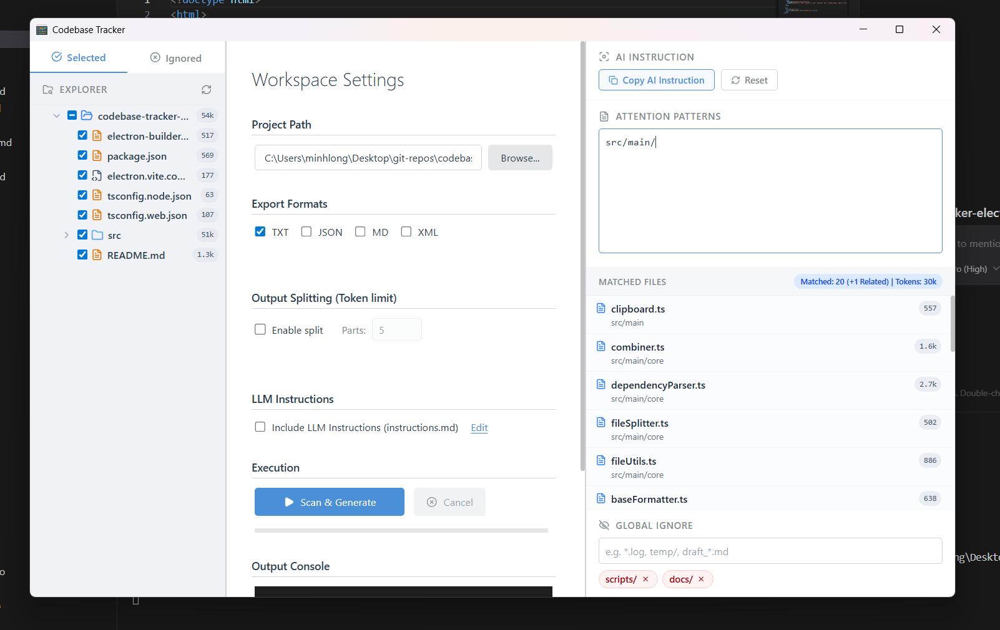

# 📂 Codebase Tracker

**Codebase Tracker** là một ứng dụng Desktop chuyên nghiệp được xây dựng bằng Electron, React và Vite. Ứng dụng giúp bạn gom nhóm, tối ưu và trích xuất mã nguồn của dự án thành các tệp văn bản duy nhất để cung cấp bối cảnh (context) siêu chuẩn xác cho các công cụ AI (như ChatGPT, Claude, Gemini, Cursor).


## 🖼️ Giao diện (UI)

*Giao diện 3 cột trực quan: Explorer (Trái) - Control Panel (Giữa) - Attention Context (Phải).*


## ✨ Tính năng nổi bật

- 🎯 **Attention Context (Tập trung trọng tâm):** Sử dụng Glob Patterns để chỉ định các tệp quan trọng nhất (VD: `src/auth/**`). Mã nguồn sẽ được đánh dấu đặc biệt `[ATTENTION]` để AI tập trung phân tích.
- 🔗 **Phân tích Dependency thông minh:** Tự động quét các lệnh `import`/`require` trong các file Attention để tìm và đính kèm các tệp liên quan, giúp AI không bị thiếu Context.
- 📝 **Tích hợp LLM Instructions:** Cho phép đính kèm một tệp `instructions.md` (chứa system prompt, quy tắc code của dự án) trực tiếp vào đầu file kết quả để hướng dẫn AI ngay lập tức.
- 🚀 **Kiến trúc Background Worker:** Các tác vụ quét file, đọc nội dung và gom mã nguồn nặng nề được xử lý bởi một tiến trình nền (Node.js Worker) độc lập, giúp giao diện mượt mà 100% không bao giờ bị giật lag.
- 🌳 **Cây thư mục trực quan & Kéo thả:** Quản lý file dễ dàng. Kéo thả (Drag & Drop) để sắp xếp thứ tự ưu tiên của tệp/thư mục khi gom mã nguồn.
- 🤖 **Bộ lọc Global Ignore:** Nhận diện `.gitignore` và cho phép thêm các rules tùy chỉnh trực tiếp từ UI (hoặc qua Context Menu).
- 📑 **Đa định dạng xuất:** Hỗ trợ xuất mã nguồn dưới dạng: `TXT`, `JSON`, `Markdown (MD)`, và `XML`.
- ✂️ **Tự động chia nhỏ (Chunk Splitting):** Chia file kết quả thành nhiều phần (parts) để tránh vượt giới hạn Token của AI.
- 📋 **Auto Copy:** Tự động copy nội dung vào Clipboard chỉ với một nút bấm (hỗ trợ Windows, macOS, Linux).

## 🛠️ Công nghệ sử dụng

- **Core:** [Electron](https://www.electronjs.org/) (Kiến trúc Main - Renderer - Background Worker).
- **Frontend:** [React 19](https://react.dev/), [TypeScript](https://www.typescriptlang.org/).
- **UI/Layout:** [Tailwind CSS v4](https://tailwindcss.com/), `react-split` (Giao diện đa cột), `@dnd-kit` (Kéo thả).
- **Build Tool:** [Electron-Vite](https://electron-vite.org/) & [Vite](https://vitejs.dev/).

## 🚀 Hướng dẫn cài đặt

### Yêu cầu hệ thống
- [Node.js](https://nodejs.org/) (Phiên bản v18 trở lên).
- npm, yarn hoặc pnpm.

### Cài đặt và Chạy thử (Development)

1. Clone kho lưu trữ về máy:
   ```bash
   git clone <repository-url>
   cd codebase-tracker-electron
   ```

2. Cài đặt các thư viện phụ thuộc:
   ```bash
   npm install
   ```

3. Khởi chạy môi trường phát triển:
   ```bash
   npm run dev
   ```

## 📦 Đóng gói ứng dụng (Build)

Dự án hỗ trợ đóng gói trên nhiều hệ điều hành khác nhau nhờ `electron-builder`.

- **Build cho Windows:**
  ```bash
  npm run build:win
  ```
- **Build cho macOS:**
  ```bash
  npm run build:mac
  ```
- **Build cho Linux:**
  ```bash
  npm run build:linux
  ```

*Tệp cài đặt đầu ra sẽ nằm trong thư mục `dist/`.*

## 📖 Hướng dẫn sử dụng

1. **Tải dự án:** Nhập đường dẫn thư mục dự án của bạn hoặc bấm `Browse...`.
2. **Chọn lọc mã nguồn (Cột Trái):** Tích chọn các tệp bạn muốn đưa cho AI. Thêm file rác vào danh sách Ignore.
3. **Cấu hình Trọng tâm (Cột Phải):** Nhập các mẫu file (VD: `*.ts`, `src/components/**`) vào cột **Attention Patterns**. Ứng dụng sẽ tự động tìm thêm các file được import vào đó.
4. **Cấu hình Xuất (Cột Giữa):**
   - Chọn định dạng (TXT, MD, JSON, XML).
   - Bật tính năng nhúng **LLM Instructions** (có thể bấm *Edit* để sửa prompt).
   - Thiết lập tự động chia nhỏ (Split) nếu dự án lớn.
5. **Xử lý:** Bấm **Scan & Generate**.
6. **Hoàn tất:** Các file tổng hợp sẽ được lưu tại thư mục `_codebase/` nằm bên trong dự án của bạn. Bấm **Auto Copy** để dán thẳng vào AI.

## 📂 Cấu trúc thư mục cốt lõi

```text
.
├── resources/           # Icon ứng dụng (ico, icns, png)
├── src/
│   ├── main/            # Electron Main Process (Giao tiếp IPC, Quản lý vòng đời)
│   │   ├── core/        # Logic xử lý file: formatters, scanner, dependencyParser
│   │   ├── worker/      # Tiến trình nền (Worker Process) xử lý I/O nặng
│   │   ├── WorkerManager.ts # Quản lý kết nối Main <-> Worker
│   │   └── ipcHandlers.ts   # Cầu nối IPC giao tiếp với Renderer
│   ├── preload/         # Electron Preload Scripts (ContextBridge bảo mật)
│   └── renderer/        # Giao diện React (Vite)
│       └── src/
│           ├── features/# Các module UI: Sidebar, Project, Generator, Settings
│           ├── hooks/   # React Custom Hooks (useProject, useGenerator)
│           ├── App.tsx  # Layout chính (Split 3 cột)
│           └── index.html
├── electron-builder.yml # Cấu hình đóng gói ứng dụng
└── electron.vite.config.ts # Cấu hình Vite & Electron
```

## 📝 Giấy phép (License)
Dự án được tạo bởi **Minh Long**. Bạn có thể sử dụng và tuỳ chỉnh theo nhu cầu cá nhân.